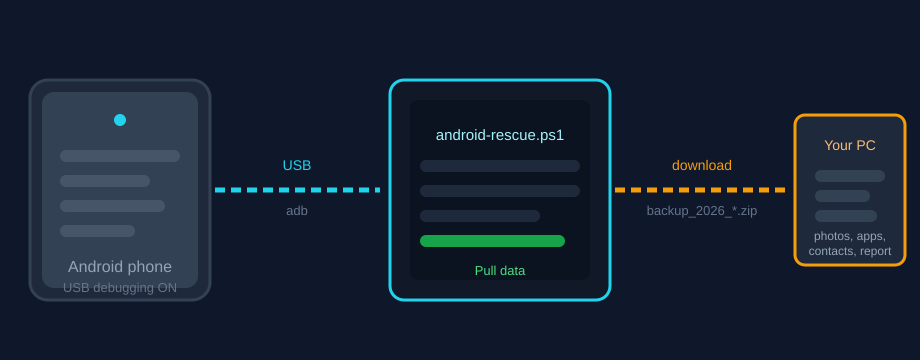
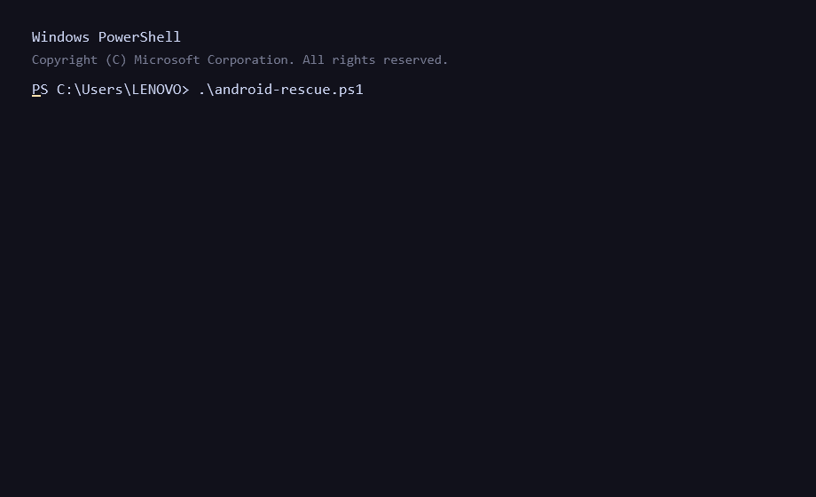

# Android Rescue

Back up your own Android phone to your PC over USB with one command. Uses Android's standard ADB interface — **no rooting, no exploits, no data sent anywhere, pure PowerShell**.






---

## Why?

- Your phone's the only copy of your photos, WhatsApp history, documents, and downloads.
- One command pulls everything into a timestamped folder and zips it.
- No Python, no Node, no cloud accounts — just `adb.exe` and PowerShell.

## Features

| What | Where it lands |
|------|----------------|
| Device info — model, Android version, battery, storage | `device_info.txt` |
| Photos & video — `DCIM`, `Pictures`, `Screenshots` | `DCIM/`, `Pictures/` |
| Files — `Download`, `Documents`, `Music`, `Movies` | dedicated folders |
| Messaging media — `WhatsApp`, `Telegram`, `VOIP` | dedicated folders |
| Installed apps (user + all) | `apps_user.txt`, `apps_all.txt` |
| Contacts | `contacts.txt` |
| SMS log | `sms.txt` |
| Call log | `call_log.txt` |
| Screenshot of the current screen | `screen.png` |
| Full system backup (optional) | `full_backup.ab` |
| Summary + everything zipped | `REPORT.txt`, `backup_....zip` |

## Requirements

- Windows with PowerShell 5.1+
- [Google platform-tools](https://dl.google.com/android/repository/platform-tools-latest-windows.zip) → unzip to `C:\platform-tools`
- Android phone with **USB debugging** enabled

## One-time phone setup

1. `Settings > About phone` — tap **Build number** 7 times (unlocks Developer Options).
2. `Settings > System > Developer options` — turn on **USB debugging**.
3. Connect via USB and accept the RSA fingerprint dialog on the phone.

> Android 11+ asks again on each new computer/connection — tap **Allow**.

## Quick start

```powershell
powershell -ExecutionPolicy Bypass -File android-rescue.ps1
```

That's it. Confirm the device listed is yours, then wait — media folders stream over USB and everything gets zipped into `backup_20260916_141233/` (your actual date/time).

## Options

```powershell
-OutDir "backup_2026"      # custom output folder
-SkipMedia                 # skip DCIM/Pictures/etc. (faster)
-SkipApps                  # skip app list
-SkipContacts              # skip contacts
-SkipSms                   # skip SMS
-SkipCallLog               # skip call log
-SkipScreenshot            # skip screenshot
-SkipZip                   # don't zip the result
-FullBasebackup            # also run adb backup -apk -shared -all
```

Examples:

```powershell
# Fast run — just documents and apps
powershell -ExecutionPolicy Bypass -File android-rescue.ps1 -SkipMedia -SkipContacts -SkipSms -SkipCallLog

# Everything including a full backup (unlock phone when prompted)
powershell -ExecutionPolicy Bypass -File android-rescue.ps1 -FullBasebackup
```

## Why some things show as blocked

Modern Android privacy protections restrict direct access to SMS, call logs, and raw contacts, even over ADB. The tool reports them honestly as **blocked** rather than pretending. For those, use:

- **Samsung Smart Switch** — pulls SMS, contacts, and call logs on Samsung phones.
- **Google / OEM cloud backup** — `Settings > System > Backup`.

Everything else — files, media, apps, metadata — works without root on any device.

## FAQ

**Is this a hack?**
No. It uses `adb pull` and `adb backup`, the same official debugging interface used by Android developers every day. Nothing is bypassed.

**Does my data leave my PC?**
No network calls. Drive letters only.

**Can I change where backups go?**
Yes — run it from another folder, or pass `-OutDir "D:\backups\phone"`.

## Legal

Use this only on devices **you own**. Accessing anyone else's phone without their permission is illegal in most jurisdictions. By running this tool you confirm you have the right to access the connected device.

## Adding real screenshots

The SVGs above are illustrations. Run the tool on your own phone, then drop actual captures into `images/real/` and update the links.

## License

[MIT](LICENSE) © TanimowoObaloluwaDavid